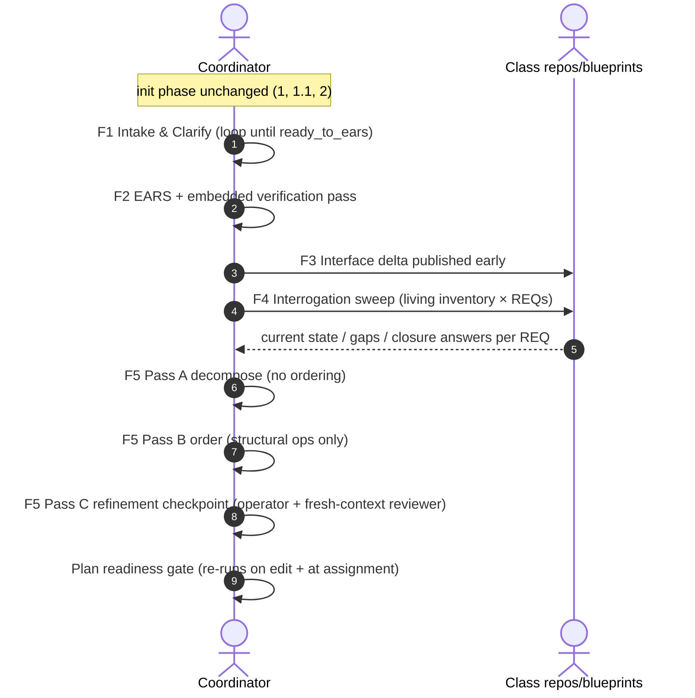

# Phase Refactoring: Redesign Proposals and Target Architecture

What we change, which problems each change solves (W1–W10 from `01_current_phase_architecture.md`), and the resulting target pipeline. This document merges the originally planned `02_phase_redesign_proposals` and `03_target_phase_architecture`.

Status: **agreed design direction, pre-implementation**. Pending decisions are listed in the section `## 8. Pending Decisions and Deferred Topics`. Implementation lands inside the TypeScript skills port (`design_docs/to_skills_migration/`), not as patches to the current shell+md pipeline.

---

## 1. Design Principles

- **P1 — Documents carry knowledge; gates enforce quality.** Stop encoding audits as sequential documents. An audit-as-document runs once and can be skipped (W4); an audit-as-gate re-runs every time its target changes.
- **P2 — One artifact per intent.** Every extra document over the same intent is a copy, and copies drift (W3).
- **P3 — Minimize paraphrase hops.** Each artifact-to-artifact hop is an LLM paraphrase that can mutate semantics (W2). Fewer hops means less drift to audit.
- **P4 — Every check is either mechanical (script) or embedded-and-mandatory (fresh-context pass writing into the target artifact).** Optional audits demonstrably don't run (W4).
- **P5 — Collapsing documents is fine; collapsing sweeps is not.** The technical side is a forced-answer sweep machine ("did we forget anything important?" asked over progressively narrower rosters — see `01_current_phase_architecture.md` section `## 4. Composition Patterns`). Every roster×question sweep, the explicit-`none` discipline, and the discovery cognition (unknown-unknown surface sweep, dependency-closure discovery, decompose-then-order separation) must survive any step merge intact. This is the acceptance test for the whole redesign — see the Sweep Survival Map in section `## 3. Target Pipeline`. (The first draft of this redesign silently deleted the 8.2 discovery half — caught and corrected.)
- **P6 — The EARS wall holds in both directions.** No technology in EARS; no business-visible functionality entering the plan without a REQ ID.

## 2. Problem → Change Map

| Problem | Change | What improves |
|---|---|---|
| W1 enforcement gap | Prose conditions become script gates where mechanically checkable (coverage, closure, dep graph, mirror rules, pass-B structural diff); the rest become embedded mandatory passes | Declared gate = enforced gate |
| W2 paraphrase hops | 12 feature steps → 5; paraphrase hops from captured input to plan: 5 → 4, and the pure re-paraphrase hop (slices → plan) is eliminated by the Pass B structural-ops rule | Less drift to create, less to audit |
| W3 duplicate documents | Slices become a drafting pass inside the plan artifact; surface inventory and per-REQ gaps merge into one grounding artifact | Whole error class (copy divergence) deleted |
| W4 skippable audits / value under-recording | 5.1 → embedded mandatory verification section in EARS; 7.1 → enrichment flag, not a step; 8.2 mechanical half + 8.4 mechanical finding types → re-runnable gates on the plan; **8.4's interactive refinement session is retained and promoted to a mandatory F5 pass** (it was the most valuable step in real usage) | Audits always run; gates re-run on edit and at assignment; the human refinement checkpoint stops being optional |
| W5 discovery/verification conflated | 8.2 split: discovery = per-REQ closure question inside grounding step; verification = mechanical zero-unmet plan gate | Each job gets the right tool; check re-runs |
| W6 ceremony cost | Artifact count ~13 → ~6–7; living surface inventory removes per-feature full regeneration | Majority of wall-time tail removed without losing gates |
| W7 residual type branching | Target step definitions gate only on `class_repo_paths.<class>.state` (per-class transition design); `project_type_code` stays init-time bookkeeping | Internal consistency; matches settled June 2026 design |
| W8 two sources of truth | Target: YAML step definitions are canonical; diagram generated or explicitly labeled derived | Drift impossible or at least declared |
| W9 forward-only | Out of scope (deferred feedback-loop topic) but target artifacts keep step/REQ id currency and promise model unchanged so the loop can attach later | No regression on the deferred path |
| W10 disposition gap | Two-case model: business gaps resolved during intake/EARS prep (ledger questions → gap-complete EARS); technical gaps at the closure sweep (plumbing step or spawned feature); see `## 8.` | EARS wall preserved from below without post-hoc appends in the normal flow |

## 3. Target Pipeline

Init phase: **unchanged** (steps 1, 1.1, 2 — three distinct intents, no duplication observed).

Feature phase: 12 steps → **5 steps**.

| # | Step | Absorbs | Artifact(s) | Gate |
|---|---|---|---|---|
| F1 | Intake & Clarify | 3, 4.1, 4.2 | `feature_br_summary.md`, `user_br_input.md`, `missing_br_data.md` (ledger) | `ready_to_ears: true` (existing helper gate) |
| F2 | Formal Requirements | 5, 5.1 | `requirements_ears.md` with mandatory embedded `## Verification` section | no escalated findings; verification pass ran |
| F3 | Interface Delta | 6 | `feature_contract_delta.md` | mirror rules as script check |
| F4 | Grounded Technical Picture | 7, 7.1, 8 | `feature_grounding.md` (working title) + project-level living surface inventory | interrogation coverage: every inventory surface × feature answered; every REQ has current-state/gap + closure answer |
| F5 | Implementation Plan | 8.1, 8.3, 8.4 (+ 8.2 verification as gate) | `implementation_plan.md` | plan readiness gate (mechanical, see `## 5.`) + mandatory Pass C refinement checkpoint |

### F1 — Intake & Clarify

One step, one gate. All anti-hallucination mechanics survive unchanged: verbatim source capture, `[UNFILLED]` discipline, ambiguity triggers, missing-data ledger, per-class repo scan gating, human-in-the-loop Q&A until `ready_to_ears`. Merge rationale: step 3 is mechanical scaffolding, 4.1/4.2 already operate as one loop in practice.

F1 is also where **business-perspective gaps are resolved** (case 1 of the two-case model, section `## 8.`): repo/blueprint analysis runs first, so gaps discovered against current reality become operator clarification questions via the ledger — and the answers enter the brief before formalization.

### F2 — Formal Requirements

EARS stays a distinct formalization step (the ID currency is load-bearing — worker commits reference REQ ids). Change: the drift audit (old 5.1) becomes a mandatory embedded verification pass — fresh context, checks EARS against `feature_br_summary.md`, writes findings + dispositions into the EARS document's own `## Verification` section. Findings live with what they qualify; the audit cannot be skipped.

Because F1 resolved business gaps before formalization, EARS is **gap-complete by construction and immutable after F2** in the normal flow (the only exception path is the open sliver in section `## 8.`).

### F3 — Interface Delta

Unchanged in substance — it is the parallelism enabler and is small in practice. The forced-answer discipline is retained: "no shared-contract change" must still be recorded as an explicit statement, never left implicit. The per-backend transport/schema mirror rules move from prose conditions to a script check.

### F4 — Grounded Technical Picture

Merges the surface sweep (7) and per-REQ gap analysis (8) into one grounding artifact, and splits the surface map into:

- **Project-level living surface inventory** — maintained across features, updated as features land. Mechanical bookkeeping.
- **Per-feature interrogation sweep** — the feature runs the full "must we touch this to make the feature work?" question against every inventory row (inventory × requirements). This *preserves and strengthens* the unknown-unknown detector: sweep completeness no longer depends on each feature's regeneration being exhaustive; missing a surface requires the inventory to be wrong, not one scan to be lazy.

Per REQ, the grounding artifact records: current state (`transport_layer` / `user_reachable_surface` split retained), gap, impacted components with repo ownership, and the **closure question** (moved here from old 8.2): *"what must exist for this REQ to be invocable end-to-end, and does it?"* Discovery happens where the evidence is already in view, one hop earlier than today. Evidence ladder unchanged: repo scan → in-flight promises → blueprint → placeholder. MCP knowledge-base enrichment becomes an optional flag on this step, not a separate step.

The explicit-`none` discipline is retained everywhere in F4: every active class must be swept, every row answers both subfields (`none` allowed, blank not), every REQ answers the closure question — forgetting stays a visible lie, not a silent skip.

### Sweep Survival Map

Per P5, every current forced-answer sweep must have a named home in the target. This table is the redesign's acceptance checklist:

| Current sweep ("did we forget…?") | Target home |
|---|---|
| 6: a shared-contract impact? (explicit "no delta") | F3, unchanged |
| 6: the agreed cross-class transport/schema? (mirror) | F3 mirror script check |
| 7: a class? (artifact per active class) | F4 gate: every active class swept or explicitly `deferred` |
| 7: a surface? (enumeration + interrogation) | F4 inventory × requirements sweep (strengthened: maintained inventory) |
| 7: delivery vs reachability side? (both subfields per row) | F4 row schema, unchanged |
| 7: that we actually don't know? (evidence tier per row) | F4 evidence ladder, unchanged |
| 8: a requirement without a technical answer? | F4 per-REQ current-state/gap, gate-checked |
| 8.2: a load-bearing prerequisite? | F4 closure question (discovery) + F5 readiness gate item 2 (zero-unmet, re-runnable) |
| 8.1: delivering the user-facing thing itself? | F5 Pass A preserved-surface requirement + readiness gate item 3 |
| 8.3: a sequencing dependency / repo owner? | F5 Pass B + readiness gate items 4–5 |
| 8.4: coherence + operator improvements? | F5 Pass C (mandatory) + gate re-run after each applied change |

### F5 — Implementation Plan

One artifact, three mandatory passes with different permissions. Passes A/B **enforce** the decompose/order separation of concerns that the old 8.1/8.3 pair intended but did not enforce (old 8.3 re-paraphrased every slice bullet, blending concerns and adding a drift hop); Pass C keeps the human refinement checkpoint that proved most valuable in real usage:

- **Pass A — decompose** (old 8.1 mindset): slice candidates, value-first, thin vertical cuts, first usable increment, preserved operator surfaces explicit. Non-goal, as today: no global ordering. Pass A output is committed before Pass B starts.
- **Pass B — order** (old 8.3 mindset, fresh context — structurally "a second person"): transform slices into ordered worker-assignable steps using **structural operations only** — reorder, split, merge, group, assign step-ids / `#### Repo:` / `#### Depends on:`, insert coordination steps. **Rewriting bullet semantics is prohibited.** If Pass B needs to reword a slice, that is a decomposition defect: it goes back to Pass A explicitly. A prose-diff check can verify Pass B changed structure, not wording.

- **Pass C — refinement checkpoint** (old 8.4, promoted from optional to mandatory): the interactive session where the operator and a fresh-context reviewer improve the plan before it commits. In real usage this was reported as one of the most helpful steps — the place where all accumulated improvements were applied — so the target design keeps it as a first-class pass, not a residue. Scope: semantic finding types (step scope overlap, requirement grouping) *plus* free-form operator improvements; findings and dispositions are recorded in the plan's meta section. The mechanical gate re-runs after every applied change (fixing today's "nothing re-checks an edited plan"). This is also the natural site for plan-commit collision review against sibling promises (surface overlaps → findings shown to the operator, per the concurrency design).

Design symmetry worth preserving: the pipeline has exactly two human-judgment gates, one on each side of the EARS wall — `ready_to_ears` on the business side (F1) and the Pass C refinement checkpoint on the technical side (F5). Everything between them is either LLM passes or mechanical checks.

The worker handoff format (`#### Repo/Depends on/Evidence/Preserved Surface/Assigned`, cross-feature dep syntax, step sizing) is unchanged — workers and the promise/concurrency model are unaffected.

## 4. Artifact Inventory Before → After

| Current (per feature) | Target |
|---|---|
| `feature_br_summary.md` | kept (F1) |
| `user_br_input.md` | kept (F1) |
| `missing_br_data.md` | kept (F1, ledger) |
| `requirements_ears.md` | kept (F2), gains embedded `## Verification` |
| `requirements_ears_review.md` | **absorbed** into F2 verification section |
| `feature_contract_delta.md` | kept (F3) |
| `project_surface_struct_resp_map_<class>.md` (per feature, per class) | **replaced** by project-level living inventory + feature grounding artifact (F4) |
| `technical_requirements.md` | **merged** into feature grounding artifact (F4) |
| `implementation_slices.md` | **absorbed** as Pass A of F5 (drafting stage inside the plan artifact) |
| `prerequisite_gaps.md` | **split**: discovery → F4 closure answers; verification → F5 mechanical gate |
| `implementation_plan.md` | kept (F5), unchanged worker-facing format |
| `implementation_plan_semantic_review.md` | **transformed**: mechanical finding types → F5 gate; the interactive refinement session → mandatory F5 Pass C, findings/dispositions recorded in plan meta |

Net: ~13 artifacts → ~6–7. Paraphrase hops from captured input to plan: 5 → 4 (input → brief → EARS → grounding → plan draft), with the former fifth hop (slices → plan re-paraphrase) eliminated by the Pass B structural-ops rule.

## 5. Mechanical Gate Inventory (target)

Plan readiness gate — runs on every plan edit **and** at worker-assignment time (consistent with "assignment is the execution gate" from the concurrency design):

1. Every REQ/NFR maps to ≥1 plan step or an explicit recorded deferral.
2. Every unmet prerequisite from F4 closure answers is scheduled (step ref) or resolved by a committed cross-feature promise — zero-unmet.
3. Every required missing `user_reachable_surface` from F4 appears as a `#### Preserved Surface:` on some step (covers the old 8.4's only recurring finding type — operator reachability — deterministically).
4. Dependency graph acyclic, including cross-feature refs; steps with incomplete cross-feature deps get a hold marker (existing rule, unchanged).
5. Each step has exactly one `#### Repo:` owner.
6. Pass B structural diff: bullet prose unchanged between committed Pass A and final plan.

Other gates: `ready_to_ears` (existing), EARS verification ran with zero escalated findings, F3 mirror script check, F4 interrogation-coverage check, and **Pass C operator sign-off** — an explicit operator-set key in the plan's meta (e.g., `plan_approved_by_operator: true`), the technical-side twin of `ready_to_ears`. Without it the plan cannot commit or emit promises; finding dispositions alone do not satisfy it, so the model cannot complete Pass C solo.

## 6. What Is Deliberately NOT Cut

- EARS as a separate formalization step (coordination currency).
- `feature_contract_delta.md` as a separate early step (parallelism enabler).
- Evidence-tier ladder and per-class `state` gating (settled per-class transition design).
- The `ready_to_ears` human-in-the-loop clarify gate (anti-hallucination core).
- The interactive plan refinement checkpoint (old 8.4) — promoted from optional to mandatory F5 Pass C; reported as one of the most helpful steps in real usage.
- The worker handoff contract and the promise/concurrency model (all-or-nothing promise eligibility, hold markers, collision detection at plan commit).
- The forced-answer sweep discipline: every roster×question sweep survives (see Sweep Survival Map), and "nothing" is always an explicit recorded `none`, never an implicit skip.

## 7. Target Flow (informal)

## 8. Pending Decisions and Deferred Topics

- **Prerequisite handling — two-case model (settled, one sliver open).** Gaps split by perspective, not by size:
  - *Business-perspective gaps* are resolved on the business side, **before EARS is minted**: intake analyzes what is already implemented first, discovered gaps become operator clarification questions via the missing-data ledger, and EARS comes out gap-complete (C-level example: no role distinction found → operator decides `C_LEVEL` role → REQ from the start). In the normal flow EARS is immutable after F2 and the wall is never breached from below.
  - *Technical-perspective gaps* are what the F4 closure sweep exists for: pure plumbing → plan step (evidence-linked, no REQ needed); large independent work → spawn a prerequisite feature (precedent: admin auth) and depend on it via cross-feature promises.
  - *Open sliver*: the exception path when F4 grounding proves a **business-visible** gap that intake missed. Candidates: loop back to F2 with operator confirmation (controlled EARS append as exception, not norm) vs. always spawn a feature. Decide during Phase 0.
- **Living inventory bootstrap.** How the project-level surface inventory is first built for existing repos (candidate: generated from the last feature's surface maps + one full scan) and how/when features landing updates it.
- **Feedback loop (deferred).** Worker → coordinator re-planning, promise invalidation, `already_satisfied` outcomes — separate design thread; this redesign must stay attachment-friendly (step/REQ currency and promise model unchanged).
- **Multi-repo class (deferred).** class=repo=worker 1:1:1 assumption unchanged here; list-shaped `class_repo_paths` hedge stands.
- **Feature-size proportionality (unresolved).** W6 is only partly addressed by step reduction; a deliberate lightweight path for small features was discussed but not designed.
