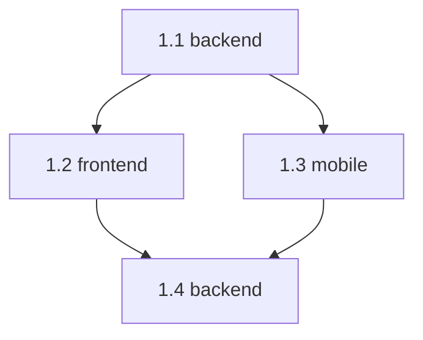

## Why

`implementation_plan.md` already encodes cross-step dependencies through `#### Depends on:`, and the existing quality helper already prevents forward references, which makes a passing plan acyclic in practice. What is still missing is a deterministic, human-readable dependency report that makes the execution graph easy to inspect, review, and attach to ASDLC artifacts.

## What Changes

- Add a dedicated helper contract for generating a dependency-graph report from `implementation_plan.md`.
- Require the helper to parse `### Step ...`, `#### Repo: ...`, and `#### Depends on: ...` blocks and build a directed acyclic graph view for valid plans.
- Require the helper to fail with a deterministic non-zero exit when the plan contains malformed dependency metadata or a cycle.
- Require the helper to emit a human-readable report in Markdown or another plain-text format suitable for terminal output, commit review, and artifact inspection.
- Require the report to include a Mermaid `graph TD` block so users can visualize step ordering directly from the generated artifact.
- Require the report to summarize node count, edge count, and acyclic status, and to list each step with its direct dependencies.
- Allow `check_implementation_plan_quality.sh` to remain the structural quality gate while the new helper runs after it as a graph/report proof step.
- Stage the new helper through ASDLC bootstrap/update flows so generated workspaces receive it alongside the existing implementation-plan quality helper.

Example Mermaid output shape:

## Capabilities

### New Capabilities

- `overmind-implementation-plan-dependency-graph-report`: Implementation-plan tooling SHALL generate a deterministic dependency-graph report with Mermaid visualization and SHALL fail when dependency metadata is cyclic or structurally invalid for graph construction.

### Modified Capabilities

- None.

## Impact

- Affected scripts:
  - `overmind/scripts/helper/check_implementation_plan_quality.sh`
  - `overmind/scripts/helper/<new dependency graph helper>`
  - `overmind/scripts/project_mgmt/project_setup_first_init_machine.sh`
- Affected tests:
  - `tests/ai_scripts/check_implementation_plan_quality_tests.sh`
  - `tests/ai_scripts/project_setup_asdlc_tests.sh`
  - `tests/ai_scripts/<new dependency graph helper tests>`
- Affected docs:
  - `Readme.md`
  - `AGENTS.md` if helper-command guidance changes
- Affected artifacts:
  - Human-readable dependency report emitted from `implementation_plan.md`, preferably as Markdown so the Mermaid block renders in supporting viewers
