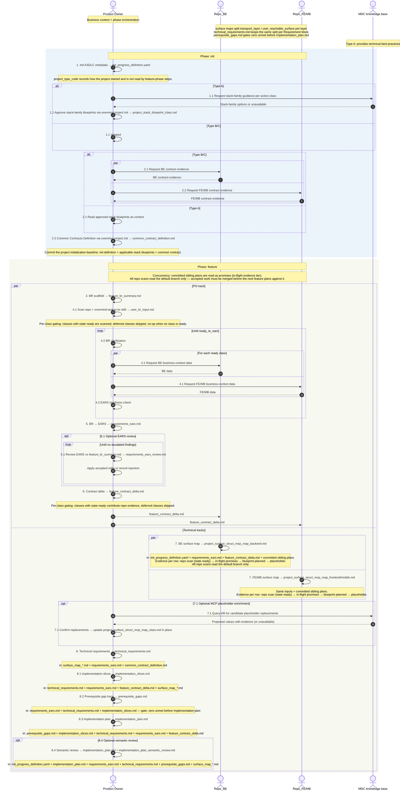

# Init Progress Definition

Single source of truth (Mermaid embedded below).
Operational note: `node .overmind/overmind.js project init --path projects/<project-id>` owns init steps 1.1 and 2 through the TypeScript coordinator and generic executor. `node .overmind/overmind.js run [--path projects/<project-id>]` runs the business requirements scaffold, resolves `feature_path`, evaluates selected-feature progress through the in-process sequencing core each run, then continues from the canonical next step (or `--resume <step>`). When `--path` is omitted, the command uses the only project under `projects/` or prompts the user to choose one. The last selected feature is cached in `projects/<project-id>/.overmind_feature_state.json`.

