# Init Progress Definition

Single source of truth (Mermaid embedded below).

```mermaid
sequenceDiagram
  autonumber
  actor PO as Product Owner
  actor BE as Repo_BE
  actor FE as Repo_FE/MB
  actor KB as MDC knowledge base

  Note over PO: Business context + phase orchestration
  Note over BE, FE: 7: surface map (transport_layer / user_reachable_surface per layer)<br/>8: technical_requirements.md (same split per Requirement block)<br/>8.1: implementation_slices.md<br/>8.2: prerequisite_gaps.md — gate: zero unmet before 8.3<br/>8.3: implementation_plan.md
  Note over KB: Type A: provides technical best-practices

  rect rgb(236, 244, 251)
    Note over PO,FE: Phase: init
    PO->>PO: 1. Init ASDLC metadata → init_progress_definition.yaml

    alt Type A
      PO->>KB: 1.1 Request stack-family guidance per active class
      KB-->>PO: Stack-family options or unavailable
      PO->>PO: 1.1 Approve stack-family blueprints → project_stack_blueprint_<class>.md
    else Type B/C
      PO->>PO: 1.1 skipped
    end

    alt Type B/C
      par
        PO->>BE: 2.1 Request BE contract evidence
        BE-->>PO: BE contract evidence
      and
        PO->>FE: 2.2 Request FE/MB contract evidence
        FE-->>PO: FE/MB contract evidence
      end
    else Type A
      PO->>PO: 2.1 Read approved stack blueprints as context
    end

    PO->>PO: 2.3 Common Contracts Definition → common_contract_definition.md
  end

  rect rgb(247, 248, 240)
    Note over PO,FE: Phase: feature
    par PO track
      PO->>PO: 3. BR scaffold → feature_br_summary.md
      PO->>PO: 4.1 Scan repo + task-to-BR → user_br_input.md
      loop Until ready_to_ears
        PO->>PO: 4.2 BR clarification
        alt Type B/C
          par
            PO->>BE: 4.1 Request BE business-context data
            BE-->>PO: BE data
          and
            PO->>FE: 4.1 Request FE/MB business-context data
            FE-->>PO: FE/MB data
          end
        else Type A
          PO->>PO: 4.1 skipped
        end
        PO->>PO: 4.2 EARS readiness check
      end
      PO->>PO: 5. BR → EARS → requirements_ears.md
      opt 5.1 Optional EARS review
        loop Until no escalated findings
          PO->>PO: 5.1 Review EARS vs user_br_input.md → requirements_ears_review.md
          PO->>PO: Apply accepted edits or record rejection
        end
      end
      PO->>PO: 6. Contract delta → feature_contract_delta.md
      PO-->>BE: feature_contract_delta.md
      PO-->>FE: feature_contract_delta.md
    and Technical tracks
      alt Type B/C
        par
          BE->>BE: 7. BE surface map<br/>in: init_progress_definition.yaml + requirements_ears.md + feature_contract_delta.md + BE repo<br/>→ project_surface_struct_resp_map_backend.md
        and
          FE->>FE: 7. FE/MB surface map<br/>in: same + FE/MB repo<br/>→ project_surface_struct_resp_map_frontend/mobile.md
        end
      else Type A
        par
          BE->>BE: 7. BE surface map<br/>in: init_progress_definition.yaml + requirements_ears.md + feature_contract_delta.md<br/>+ repo evidence (if ready repo path) + project_stack_blueprint_backend.md (planned fallback)<br/>→ project_surface_struct_resp_map_backend.md
        and
          FE->>FE: 7. FE/MB surface map<br/>in: same + repo evidence (if ready repo path) + project_stack_blueprint_frontend/mobile.md (planned fallback)<br/>→ project_surface_struct_resp_map_frontend/mobile.md
        end
      end

      opt 7.1 Optional MCP placeholder enrichment
        PO->>KB: 7.1 Query KB for candidate replacements for <to be defined during implementation> placeholders
        KB-->>PO: Proposed values with evidence (or unavailable)
        PO->>PO: 7.1 Confirm proposed replacements → update project_surface_struct_resp_map_<class>.md in place
      end

      alt Type B/C
        PO->>PO: 8. Technical requirements<br/>in: surface_map_*.md + requirements_ears.md + common_contract_definition.md<br/>→ technical_requirements.md
      else Type A
        PO->>PO: 8. Technical requirements (MCP)<br/>in: surface_map_*.md + requirements_ears.md + common_contract_definition.md + MCP<br/>→ technical_requirements.md
      end

      alt Type B/C
        PO->>PO: 8.1 Implementation slices<br/>in: technical_requirements.md + requirements_ears.md + feature_contract_delta.md + surface_map_*.md<br/>→ implementation_slices.md
      else Type A
        PO->>PO: 8.1 Implementation slices (MCP)<br/>in: technical_requirements.md + requirements_ears.md + feature_contract_delta.md + surface_map_*.md + MCP<br/>→ implementation_slices.md
      end

      PO->>PO: 8.2 Prerequisite gap trace<br/>in: requirements_ears.md + technical_requirements.md + implementation_slices.md<br/>→ prerequisite_gaps.md | gate: zero unmet before 8.3

      alt Type B/C
        PO->>PO: 8.3 Implementation plan<br/>in: prerequisite_gaps.md + implementation_slices.md + technical_requirements.md + requirements_ears.md + feature_contract_delta.md<br/>→ implementation_plan.md
      else Type A
        PO->>PO: 8.3 Implementation plan (MCP)<br/>in: prerequisite_gaps.md + implementation_slices.md + technical_requirements.md + requirements_ears.md + feature_contract_delta.md + MCP<br/>→ implementation_plan.md
      end
      opt 8.4 Optional semantic review
        PO->>PO: 8.4 Semantic review<br/>in: init_progress_definition.yaml + implementation_plan.md + requirements_ears.md + technical_requirements.md + prerequisite_gaps.md + surface_map_*.md<br/>→ implementation_plan.md + implementation_plan_semantic_review.md
      end
    end
  end
```

Operational note: `project_add_feature_e2e.sh [--path projects/<project-id>]` runs Step 3 scaffold, resolves `feature_path`, calls `init_progress_scanner.sh` each run, then continues from scanner `next step` (or `--resume <step>`). When `--path` is omitted, the script uses the only project under `projects/` or prompts the user to choose one.

