# Init Progress Definition

Single source of truth (Mermaid embedded below).

```mermaid
sequenceDiagram
  autonumber
  actor PO as Product Owner
  actor BE as Repo_BE
  actor FE as Repo_FE/MB
  actor KB as MDC knowledge base

  Note over PO: Owns business context and phase orchestration
  Note over BE, FE: Step 7 prepares repo execution context<br/>Step 8 consolidates current-state evidence<br/>Step 8.1 discovers executable slices<br/>Step 8.2 produces one shared implementation plan with repo-owned steps
  Note over KB: For project type A, provide technical best-practices

  rect rgb(236, 244, 251)
    Note over PO,FE: Phase: init
    PO->>PO: 1. Initialize Repo ASDLC Metadata<br/>Output: init_progress_definition.yaml

    alt Project type B or C
      par Contract input collection
        PO->>BE: 2.1 Request backend req/resp contract evidence (if backend class active)
        BE-->>PO: Backend req/resp contract evidence
      and
        PO->>FE: 2.2 Request frontend/mobile req/resp contract evidence (if frontend/mobile class active)
        FE-->>PO: Frontend/mobile req/resp contract evidence
      end
    else Project type A
      PO->>KB: 2.1 Request MCP contract best practices
      KB-->>PO: MCP contract guidance
    end

    PO->>PO: 2.3 Create Cross-Project Contract Inventory and Common Contracts Definition<br/>Input: BE/FE req/resp evidence or MCP guidance<br/>Output: common_contract_definition.md
  end

  rect rgb(247, 248, 240)
    Note over PO,FE: Phase: feature
    par Product Owner track
      PO->>PO: 3. Initialize and Enrich Business Requirements Structuring (scaffold)<br/>Output: feature_br_summary.md
      PO->>PO: 4.1 Scan repo and apply task-to-BR update<br/>Output: user_br_input.md
      loop Until ready_to_ears == true
        PO->>PO: 4.2 user_br_clarification
        alt Project type B or C
          par Req/resp fetch for step 4.1
            PO->>BE: 4.1 Request backend business-context req/resp data (if backend class active)
            BE-->>PO: Backend business-context req/resp data
          and
            PO->>FE: 4.1 Request frontend/mobile business-context req/resp data (if frontend/mobile class active)
            FE-->>PO: Frontend/mobile business-context req/resp data
          end
        else Project type A
          PO->>PO: 4.1 skipped for project type A
        end
        PO->>PO: 4.2 ready_to_ears conversion check
      end
      PO->>PO: 5. Convert Business Requirements Structuring to EARS<br/>Output: requirements_ears.md
      opt 5.1 Optional requirements_ears extra review
        loop Until review ledger has no escalated findings
          PO->>PO: 5.1 Review requirements_ears.md against user_br_input.md<br/>Output: requirements_ears_review.md
          PO->>PO: Show finding + recommendation, then ask: "Should I add recommended changes?"<br/>Apply accepted EARS edits or record rejection/postponement
        end
      end
      PO->>PO: 6. Define Feature Contract Delta<br/>Input: requirements_ears.md + common_contract_definition.md<br/>Output: feature_contract_delta.md
      PO-->>BE: Provide feature_contract_delta.md (if backend class active)
      PO-->>FE: Provide feature_contract_delta.md (if frontend/mobile class active)
    and Technical tracks
      alt Project type B or C
        par Repo analysis + execution context track
          BE->>BE: 7. Analyze selected repo and prepare execution context (backend iteration)<br/>Input: project-level init_progress_definition.yaml + requirements_ears.md + feature_contract_delta.md + selected ready backend repo path<br/>Output: project_surface_struct_resp_map_backend.md
        and
          FE->>FE: 7. Analyze selected repo and prepare execution context (frontend/mobile iteration)<br/>Input: project-level init_progress_definition.yaml + requirements_ears.md + feature_contract_delta.md + selected ready frontend or mobile repo path<br/>Output: project_surface_struct_resp_map_frontend.md or project_surface_struct_resp_map_mobile.md
        end
      else Project type A
        par MCP best-practice execution context track
          BE->>KB: 7. Request backend repo execution best practices (if backend class active)
          KB-->>BE: Backend best-practice req/resp
          BE->>BE: Create backend map from requirements_ears.md + feature_contract_delta.md + MCP response<br/>Output: project_surface_struct_resp_map_backend.md
        and
          FE->>KB: 7. Request frontend/mobile repo execution best practices (if frontend/mobile class active)
          KB-->>FE: Frontend/mobile best-practice req/resp
          FE->>FE: Create selected frontend/mobile map from requirements_ears.md + feature_contract_delta.md + MCP response<br/>Output: project_surface_struct_resp_map_frontend.md or project_surface_struct_resp_map_mobile.md
        end
      end

      alt Project type B or C
        BE->>BE: 8. Create shared feature-scoped technical requirements<br/>Input: applicable project_surface_struct_resp_map_*.md + requirements_ears.md + common_contract_definition.md + targeted repo evidence<br/>Output: technical_requirements.md
      else Project type A
        BE->>BE: 8. Create shared feature-scoped technical requirements using maps + requirements/contracts + MCP context<br/>Output: technical_requirements.md
      end

      alt Project type B or C
        BE->>BE: 8.1 Create shared implementation slices<br/>Input: technical_requirements.md + requirements_ears.md + feature_contract_delta.md + project_surface_struct_resp_map_*.md<br/>Output: implementation_slices.md
      else Project type A
        BE->>BE: 8.1 Create shared implementation slices using technical requirements + requirements/contracts + maps + MCP context<br/>Output: implementation_slices.md
      end

      alt Project type B or C
        BE->>BE: 8.2 Create shared implementation plan<br/>Input: implementation_slices.md + technical_requirements.md + requirements_ears.md + feature_contract_delta.md<br/>Output: implementation_plan.md
      else Project type A
        BE->>BE: 8.2 Create shared implementation plan using slices + technical requirements + requirements/contracts + MCP context<br/>Output: implementation_plan.md
      end
      opt 8.3 Optional implementation-plan semantic review
        BE->>BE: 8.3 Review implementation_plan.md, summarize findings, ask which finding numbers to apply, then update plan + review ledger<br/>Input: implementation_plan.md + requirements_ears.md + technical_requirements.md<br/>Output: implementation_plan.md + implementation_plan_semantic_review.md
      end
    end
  end
```

Operational note: staged `.commands/project_add_feature_e2e.sh --path projects/<project-id>` runs Step `3` scaffold, resolves/saves `feature_path`, calls `.commands/init_progress_scanner.sh --path <feature_path>` on each run, then continues from scanner `next step` (or from `--resume <step>` override).

